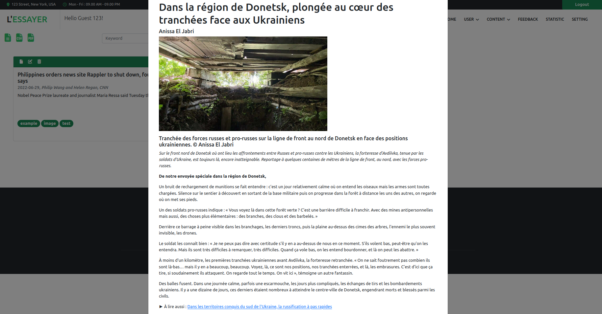
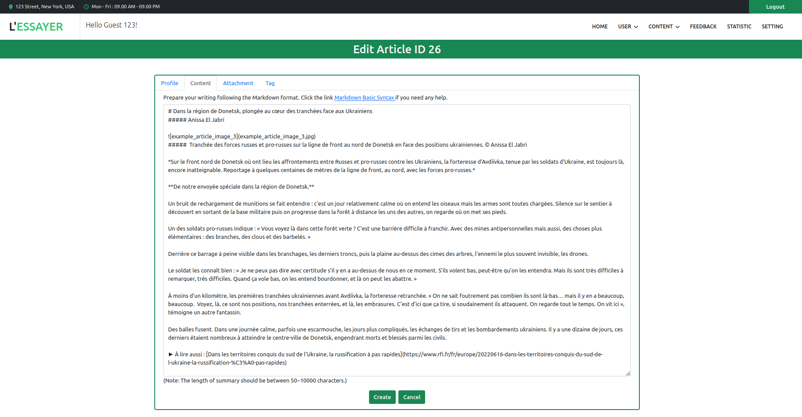
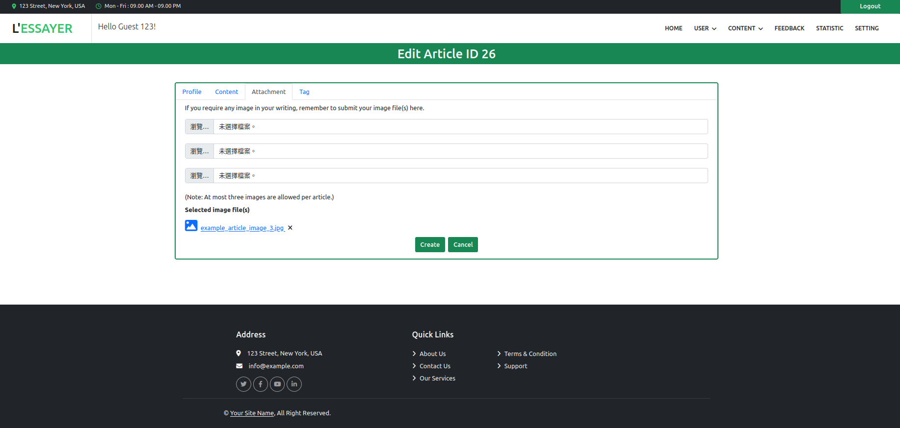
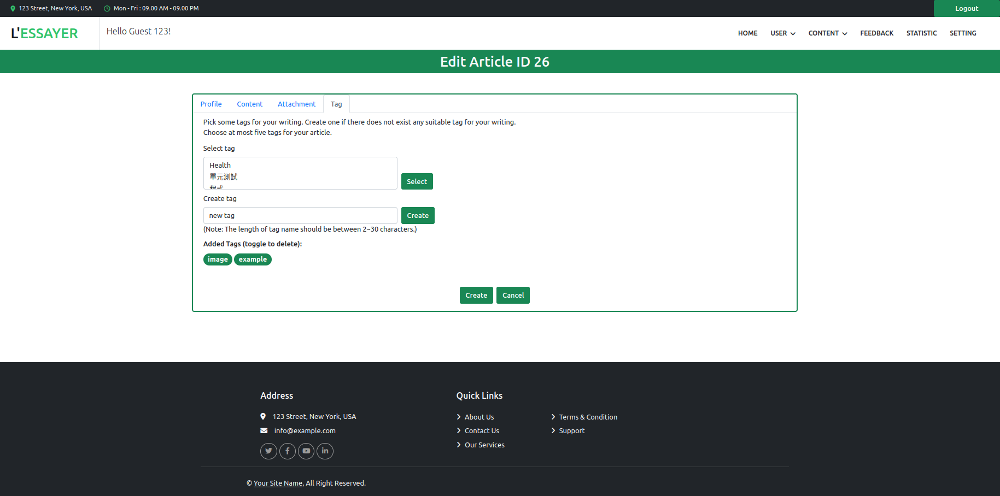
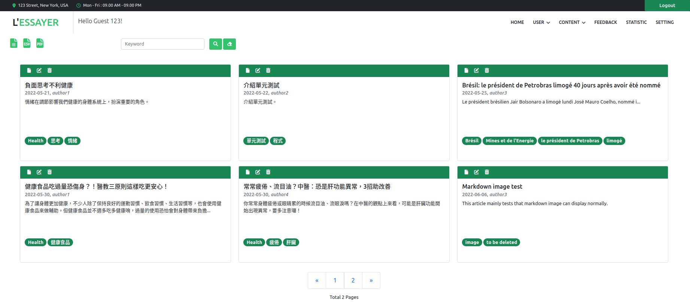
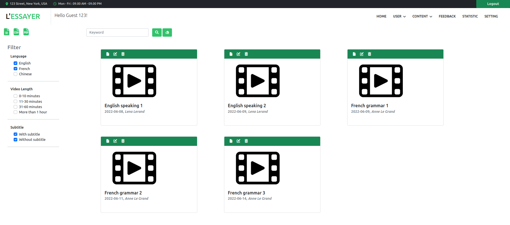
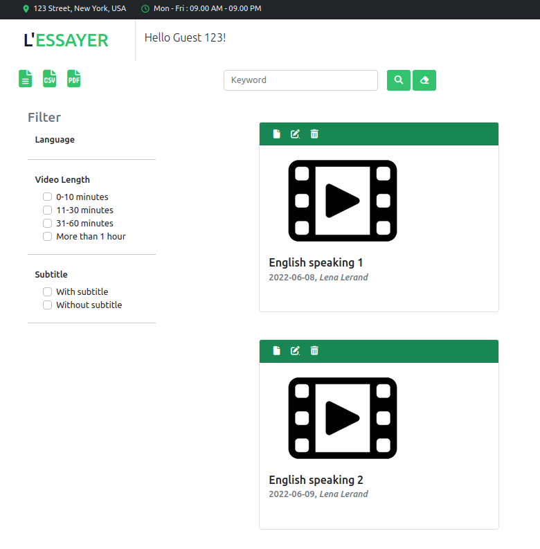
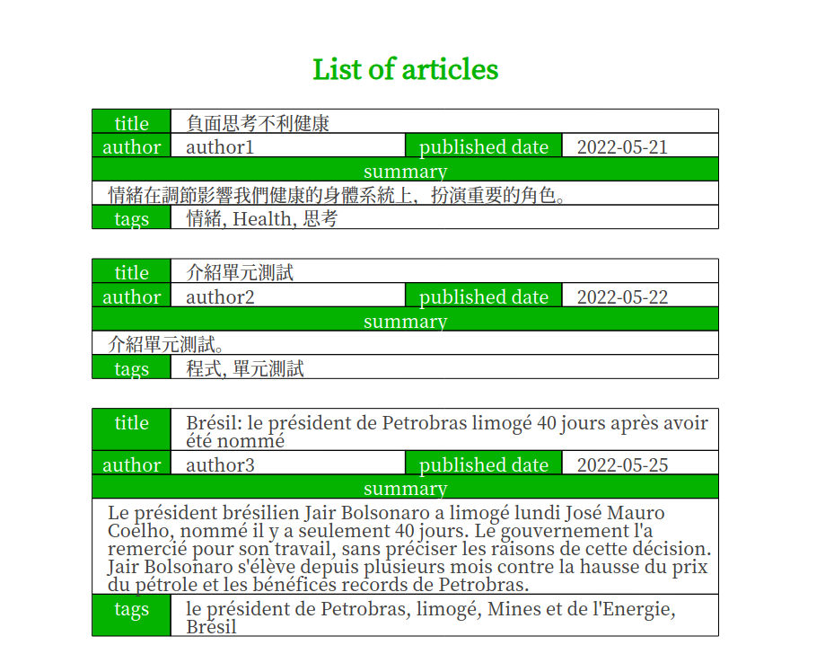
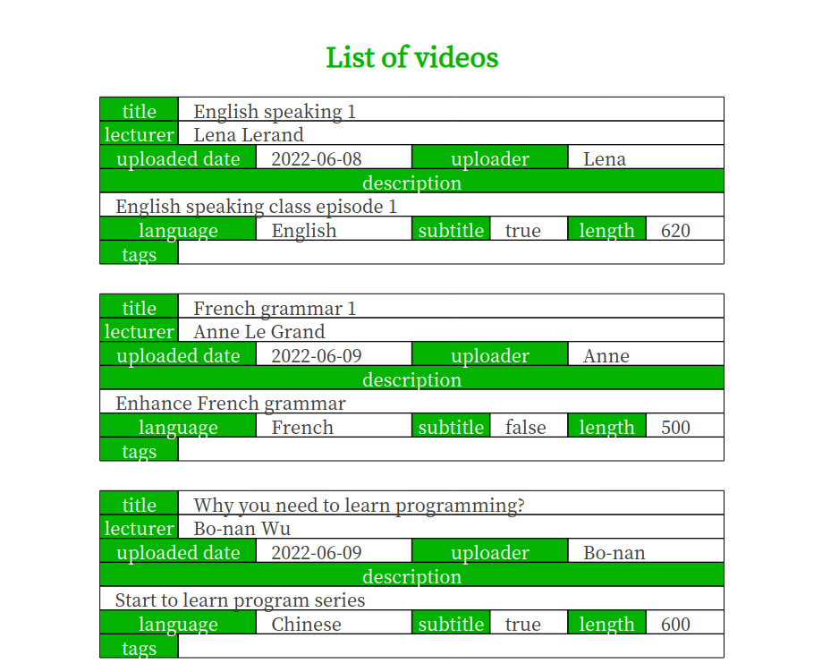
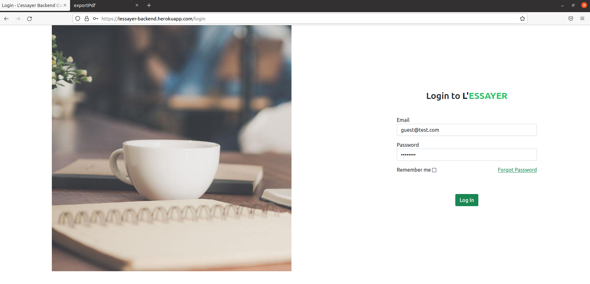

# L'essayer Content Management System

***L'essayer Content Management System*** is an on-line Content Mangement System that supports the features of managinig articles and videos. 

User can freely create their writings and edit them on the system. Each article is labeled by tags so that one can quickly classified and searched their pieces of written work. 

Rather than managing merely articles,  the system allows users submit their short films to backup these videos on the system.

## Tablet of contents

* [Features](#features)
* [Project status](#project-status)
* [Build](#build)
* [License](#license)
* [Contact](#contact)

## Features

### On-line editor for writing

***L'essayer Content Management System*** enables users to edit their writings on-line following the markdown style. With the support of markdown syntax, users can format their writings without too much efforts. Besides, with at most three images supported, the system allows users to embed images into their articles. Users can edit their pieces every time and store them on the cloud.

### Classificaion

Users can assign up to 5 tags to their articles or uploaded short films to let users more convientily search or classified their files. If there is not system-defined tag matching user's need, create one and the created tag can be re-used in the future.

### Searching and filterinig

***L'essayer Content Management System*** provides a facilitating searching function for both articles and videoes. Furthermore, the system offers a more advanced filtering function for managing users' videoes. Filter according to language, length, or with/without subscription to efficiently manage the films.

### Summarized list of all articles and videos

Users can export their article or video list into csv or pdf file as a cache to see what they have uploaded to the system.

## Project status

This project is an experimental and demonstrated project. Some functions are not ready yet but would not bother the main purpose of this project: this is a project for showing a simplified Content Management System.

***L'essayer Content Management System*** has been deployed on Heroku. Click [the link](https://lessayer-backend.herokuapp.com/) and log in with the provided guest account to hang around.

Account: ***guest@test.com***

Password: ***guest123***

## Build

### Prerequisites

To build this project, one needs to have the following items ready:

- Java 17
- Gradle
- MySQL
- Amazon Web Services acount

To improve this project, some knowledges are required:

- Java Spring
- Thymeleaf
- Bootstrap
- Amazon S3
- ...

### Steps to build

1. Download the project.
2. Configure the MySQL settings in application.yaml.
3. Configure the Amazon S3 related settings in environment variables.
4. Build the project with Gradle.

## License

This project is distributed under the GNU GPL Version 3. See LICENSE.md for more information.

## Contact

zkhuang@protonmail.com
